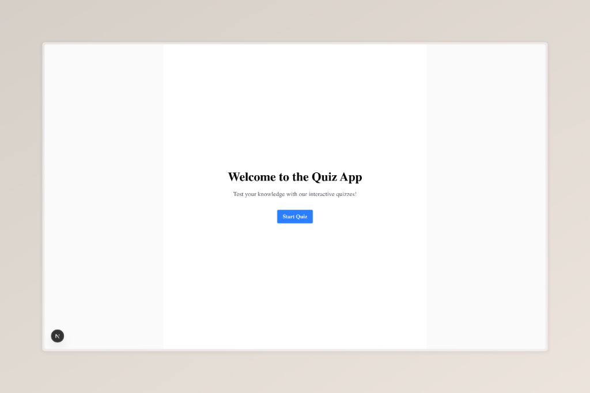
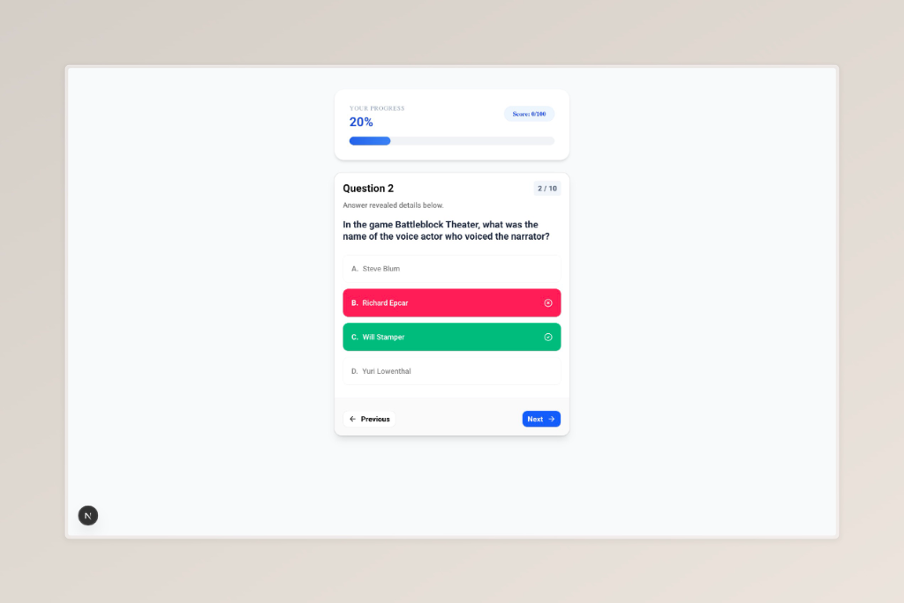
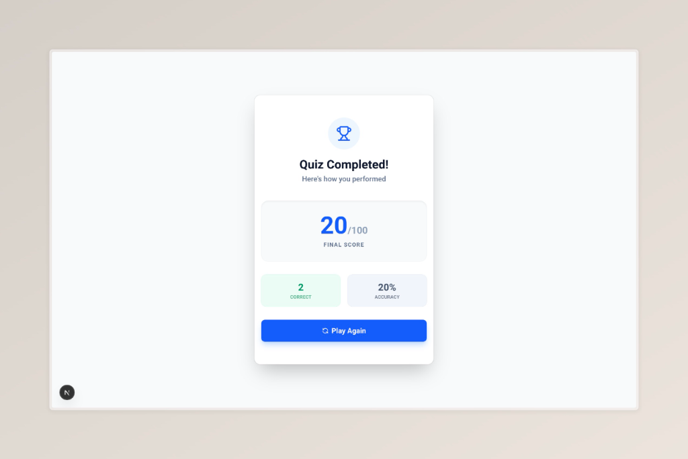

# 🧠 Premium Quiz App

A modern, interactive, and beautifully designed quiz application built with **Next.js 15**, **React 19**, and **Tailwind CSS**. This application provides a seamless trivia experience, fetching dynamic questions from the OpenTDB API.

---

## 📸 Visual Showcase

### 1. Welcome Screen
Experience a clean and inviting start to your quiz journey.


### 2. Interactive Quiz
Engage with multiple-choice questions, featuring real-time progress tracking and instant feedback.


### 3. Comprehensive Results
Review your performance with detailed statistics, including score, accuracy, and correct answer counts.


---

## ✨ Key Features

-   **🌍 Dynamic API Integration**: Fetches diverse trivia questions from the OpenTDB (Open Trivia Database) API.
-   **⚡ Real-time Progress Tracking**: Visualize your journey with a dynamic progress bar and live scoring.
-   **🎨 Premium UI/UX**: Built with a focus on aesthetics, featuring smooth transitions, hover effects, and a clean layout.
-   **🛠️ Robust State Management**: Utilizes React Context API to manage complex quiz states across different screens.
-   **📱 Fully Responsive**: Optimized for all screen sizes, from mobile devices to large desktops.
-   **🔍 HTML Decoding**: Automatically handles and decodes HTML entities in API data for perfect formatting.

---

## 🚀 Tech Stack

-   **Framework**: [Next.js 15](https://nextjs.org/)
-   **Library**: [React 19](https://react.dev/)
-   **Styling**: [Tailwind CSS](https://tailwindcss.com/)
-   **Icons**: [Lucide React](https://lucide.dev/)
-   **Components**: [shadcn/ui](https://ui.shadcn.com/)
-   **Animations**: Custom Tailwind animations

---

## 🛠️ Getting Started

Follow these steps to set up the project locally:

### 1. Clone the repository
```bash
git clone https://github.com/your-username/quiz-app.git
cd quiz-app
```

### 2. Install dependencies
```bash
npm install
```

### 3. Run the development server
```bash
npm run dev
```

Open [http://localhost:3000](http://localhost:3000) with your browser to see the result.

---

## 📂 Project Structure

-   `app/`: Contains the Next.js App Router pages and layouts.
    -   `questions/`: The main quiz engine and context provider.
    -   `result/`: The score summary page.
-   `components/`: Reusable UI components like `QuestionCard`.
-   `public/`: Static assets, including screenshots and icons.
-   `lib/`: Utility functions and shared logic.

---
